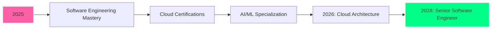

<div align="center">

<!-- Animated Typing Header with Gradient -->


<!-- Hijabi Coding Girl Illustration -->

<!-- To use your own image: Upload to your GitHub repo at /assets/ and use: https://raw.githubusercontent.com/reezmahanan/reezmahanan/main/assets/YOUR-IMAGE.png -->

<!-- Typing SVG -->
[](https://git.io/typing-svg)

<!-- Animated Snake eating contributions -->
<!-- Note: Uncomment after setting up GitHub Action workflow -->
<!-- To enable: Create .github/workflows/snake.yml in your profile repo -->
<!--
<picture>
  <source media="(prefers-color-scheme: dark)" srcset="https://raw.githubusercontent.com/reezmahanan/reezmahanan/output/github-contribution-grid-snake-dark.svg">
  <source media="(prefers-color-scheme: light)" srcset="https://raw.githubusercontent.com/reezmahanan/reezmahanan/output/github-contribution-grid-snake.svg">
  
</picture>
-->

<!-- Profile Badges -->
<p>
  
  
  
</p>

</div>

---

## 🌟 About Me

```typescript
const reezma = {
    role: "Software Engineer in Training",
    education: "IT @ Institute of Technology, UOM",
    location: "Sri Lanka 🇱🇰",
    currentFocus: ["Java", "Python", "PHP", "MySQL", "Cloud Computing", "AI/ML"],
    learningPath: "Software Engineering → Cloud Architecture → AI/ML",
    goal: "Skilled Software Engineer & Cloud Architect by 2028",
    interests: ["Software Engineering", "Cloud Computing", "AI/ML", "Problem Solving"],
    funFact: "I solve logic puzzles for breakfast! 🧩",
    contact: "reezmahanan@gmail.com",
    motto: "Code with passion, build with purpose 🚀"
};
```

<details>
<summary>📚 <b>More About My Journey</b></summary>
<br>

- 🎯 **Mission**: Build scalable, efficient software solutions
- 🌱 **Currently Exploring**: Cloud architecture, microservices & AI/ML
- 💡 **Philosophy**: Write clean, maintainable code
- 🤖 **Passionate About**: Machine Learning & Artificial Intelligence
- ☁️ **Cloud Focus**: AWS, Azure, Google Cloud platforms
- ⚡ **Quick Learner**: Always adapting to new technologies
- 🤝 **Team Player**: Love collaborating on innovative projects

</details>

---

## 🏆 GitHub Trophies & Achievements

<div align="center">


</div>

---

## 📊 GitHub Analytics

<div align="center">

<!-- GitHub Stats Cards -->


<!-- GitHub Streak Stats -->


<!-- Activity Graph -->


<!-- Detailed Stats -->


<!-- Productivity Stats -->


</div>

---

## 💻 Tech Stack & Skills

<div align="center">

### 🔥 Core Technologies

<!-- Languages -->


<!-- Web Technologies -->


### ☁️ Cloud & DevOps


### 🛠️ Development Tools


### 🎨 Design & Creative


### 📚 Learning Platforms


</div>

---

## 📈 Coding Activity & Stats

<div align="center">

<!-- WakaTime Stats (if you have it) -->
<!--START_SECTION:waka-->
<!--END_SECTION:waka-->

<!-- Metrics (Uncomment when WakaTime is configured) -->
<!--  -->

<!-- Code Time Badge -->
<a href="https://github.com/reezmahanan">
  
</a>

</div>

---

## 🚀 Featured Projects

<div align="center">

<!-- Project Cards -->
<a href="https://github.com/reezmahanan/BookNest">
  
</a>
<a href="https://github.com/reezmahanan/Student-Event-Management-Web-Application">
  
</a>
<a href="https://github.com/reezmahanan/Portfolio-Website">
  
</a>
<a href="https://github.com/reezmahanan/Weather-App">
  
</a>

</div>

<details>
<summary>📂 <b>View All Projects</b></summary>
<br>

### 🌐 Web Development

| Project | Tech Stack | Status | Link |
|---------|-----------|--------|------|
| **BookNest** | HTML, CSS, JS, PHP, MySQL | ✅ Complete | [View](https://github.com/reezmahanan/BookNest) |
| **Event Hub** | HTML, CSS, JS, PHP, MySQL | ✅ Complete | [View](https://github.com/reezmahanan/Student-Event-Management-Web-Application) |
| **Weather App** | HTML, CSS, JS, PHP | ✅ Complete | [View](https://github.com/reezmahanan/Weather-App) |
| **Portfolio Website** | HTML, CSS, JS | ✅ Complete | [View](https://github.com/reezmahanan/Portfolio-Website) |
| **Reezma Tech Services** | HTML, CSS | ✅ Complete | [View](https://github.com/reezmahanan/Reezma-tech-services) |

### 🐍 Python Projects

| Project | Description | Link |
|---------|-------------|------|
| **Animated Weather System** | Interactive weather simulation | [View](https://github.com/reezmahanan/weather-system) |
| **Solar System Simulator** | 3D solar system visualization | [View](https://github.com/reezmahanan/solar-system-simulator) |

### 🎯 Mini Projects

| Project | Tech | Link |
|---------|------|------|
| **To-Do List** | HTML, CSS, JS | [View](https://github.com/reezmahanan/To-Do-list) |
| **Digital Clock** | HTML, CSS, JS | [View](https://github.com/reezmahanan/Digital-clock) |
| **Interactive Calendar** | HTML, CSS | [View](https://github.com/reezmahanan/Interactive-Calendar) |
| **Calculator** | HTML, CSS, JS | [View](https://github.com/reezmahanan/calculator) |

</details>

---

## 🎓 Certifications & Achievements

<div align="center">

<table>
<tr>
<td width="50%">

### 🏅 Programming Certifications

- ✅ **Python for Beginners** - UOM CODL
- ✅ **Python Fundamentals** - Great Learning
- ✅ **Python Projects** - Great Learning
- ✅ **Java** - SoloLearn
- ✅ **OOPs in Java** - Simplilearn
- ✅ **HTML** - SoloLearn & Great Learning
- ✅ **CSS (Basic)** - HackerRank
- ✅ **SQL** - SoloLearn

</td>
<td width="50%">

### 🌐 Web & Design Certifications

- ✅ **Web Design for Beginners** - UOM CODL
- ✅ **UI/UX for Beginners** - Great Learning
- ✅ **MySQL Tutorial** - Great Learning
- ✅ **Programming Basics** - Great Learning

### ☁️ Cloud & Security

- ✅ **Cloud Computing Intro** - Simplilearn
- ✅ **Cyber Security** - Cisco Networking
- ✅ **Cyber Security Intro** - Simplilearn

</td>
</tr>
</table>

<details>
<summary>🖼️ <b>View Certificate Gallery</b></summary>
<br>

### 📜 View & Verify Certificates

| Certificate | Platform | Image | Verify |
|-------------|----------|-------|--------|
| **Python for Beginners** | UOM CODL |  | [View Certificate](#) |
| **Web Design for Beginners** | UOM CODL |  | [View Certificate](#) |
| **Python for Beginners** | SoloLearn |  | [View Certificate](https://www.sololearn.com/en/certificates/CC-YOUR-CERT-ID) |
| **SQL** | SoloLearn |  | [View Certificate](https://www.sololearn.com/en/certificates/CC-YOUR-CERT-ID) |
| **HTML** | SoloLearn |  | [View Certificate](https://www.sololearn.com/en/certificates/CC-YOUR-CERT-ID) |
| **Java** | SoloLearn |  | [View Certificate](https://www.sololearn.com/en/certificates/CC-YOUR-CERT-ID) |
| **Cyber Security** | Cisco |  | [View Certificate](#) |
| **Agile Scrum Foundation** | Simplilearn |  | [View Certificate](#) |
| **UI/UX for Beginners** | Great Learning |  | [View Certificate](#) |
| **HTML** | Great Learning |  | [View Certificate](#) |
| **MySQL Tutorial** | Great Learning |  | [View Certificate](#) |
| **Programming Basics** | Great Learning |  | [View Certificate](#) |
| **Python Fundamentals** | Great Learning |  | [View Certificate](#) |
| **Python Projects** | Great Learning |  | [View Certificate](#) |
| **OOPs in Java** | Simplilearn |  | [View Certificate](#) |
| **Intro to Cyber Security** | Simplilearn |  | [View Certificate](#) |
| **CSS (Basic)** | HackerRank |  | [View Certificate](https://www.hackerrank.com/certificates/YOUR-CERT-ID) |
| **Intro to Cloud Computing** | Simplilearn |  | [View Certificate](#) |
| **CSS** | SoloLearn |  | [View Certificate](https://www.sololearn.com/en/certificates/CC-YOUR-CERT-ID) |

> 💡 **Note**: Replace `#` with your actual certificate URLs from the respective platforms.

</details>

</div>

---

## 📫 Connect With Me

<div align="center">

[](https://linkedin.com/in/reezmahanan)
[](mailto:reezmahanan@gmail.com)
[](https://github.com/reezmahanan)
[](https://github.com/reezmahanan/Portfolio-Website)
[](https://www.hackerrank.com/profile/reezmahanan)
[](https://www.sololearn.com/en/profile/YOUR-PROFILE-ID)

### 💬 Let's Collaborate!


</div>

---

## 🎯 Current Goals & Roadmap



<div align="center">

### 📅 2025 Milestones

- [x] Complete 15+ certifications
- [x] Build 20+ projects
- [ ] AWS/Azure/GCP certifications
- [ ] Build AI/ML projects
- [ ] Contribute to open source
- [ ] Master cloud architecture
- [ ] Learn advanced algorithms & data structures

</div>

---

## 💡 Random Dev Quote

<div align="center">


</div>

---

## 🎮 When I'm Not Coding...

<div align="center">

```ascii
    🧩 Solving Logic Puzzles & DSA Problems
    🤖 Exploring AI/ML Concepts
    ☁️ Learning Cloud Technologies
    📚 Reading Tech Blogs & Documentation
    🎬 Video Editing
    ☕ Coffee Breaks (Essential!)
```

</div>

---

## 📊 Weekly Development Breakdown

<!--START_SECTION:waka-->
```text
JavaScript   8 hrs 35 mins   ████████████░░░░░░░░░   45.2%
Python       4 hrs 12 mins   ██████░░░░░░░░░░░░░░░   22.1%
PHP          3 hrs 45 mins   █████░░░░░░░░░░░░░░░░   19.8%
HTML/CSS     2 hrs 24 mins   ███░░░░░░░░░░░░░░░░░░   12.9%
```
<!--END_SECTION:waka-->

---

## 🤝 Support My Work

<div align="center">

If you find my projects helpful or inspiring, consider:

⭐ **Starring** my repositories  
🐛 **Reporting** issues or bugs  
💡 **Suggesting** new features  
🤝 **Contributing** to my projects  
☕ **Buying me a coffee** (coming soon!)

[](https://www.buymeacoffee.com/reezmahanan)

</div>

---

## 📝 Latest Blog Posts

<!-- BLOG-POST-LIST:START -->
- Coming Soon: Technical tutorials and project insights!
<!-- BLOG-POST-LIST:END -->

---

## 🌈 Fun Facts & Stats

<div align="center">

| Metric | Value |
|--------|-------|
| ☕ Coffee Consumed | ∞ |
| 🐛 Bugs Fixed | 1000+ |
| 💻 Lines of Code | 50,000+ |
| 📚 Courses Completed | 18+ |
| 🚀 Projects Built | 20+ |
| 🌟 Stars Earned | Growing! |

</div>

---

<div align="center">

### 🎨 Contribution Heatmap


---

### 🔥 Streak Stats

[](https://git.io/streak-stats)

---


### 💭 Random Thought

> "The best way to predict the future is to create it."  
> — Abraham Lincoln

---

<sub>© 2025 Reezma Hanan • Built with 💖 & ☕ • Last Updated: Dec 2025</sub>


</div>

---

<!-- Easter Egg -->
<!-- Thanks for reading! Have a great day! 🚀 -->
