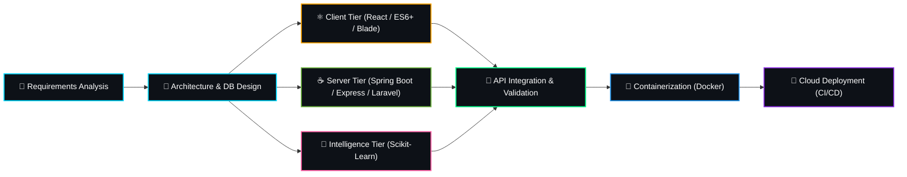

<div align="center">

<!-- Gradient Wave Header -->


<!-- Animated Typing -->


<br/>

<!-- Status & Focus Badges -->
<a href="https://www.linkedin.com/in/reezma-hanan"></a>
<a href="mailto:reezmahanan@gmail.com"></a>
<a href="https://github.com/reezmahanan"></a>
<a href="https://github.com/reezmahanan"></a>
<a href="https://github.com/reezmahanan"></a>
<a href="https://github.com/reezmahanan"></a>

<br/><br/>

<p align="center">
  <b><i>"Learn continuously, build consistently, and engineer scalable solutions that matter. 🚀"</i></b>
</p>

<!-- Decorative Line -->


</div>

## 👨‍💻 About Me

I am an **Information Technology Undergraduate at ITUM (University of Moratuwa)** passionate about engineering resilient full-stack web applications, RESTful microservices, and data-driven systems. With proven experience across **Java, React, Spring Boot, Node.js, Express, Laravel, Python, MySQL, and MongoDB**, I focus on writing modular, self-documenting, and scalable production code.

- 🔍 **Active Career Search:** Actively seeking **Software Engineering** and **Full-Stack Developer Internships** where I can solve real-world problems and collaborate with high-performing engineering teams.
- ⚡ **Core Engineering Focus:** Modern 3-tier architectures, asynchronous client-server communication, database modeling (ACID Relational & Document NoSQL), and Machine Learning integration.
- 🤝 **Community & Open Source:** Active Open Source Contributor across global programs including SWOC, GSSOC, SSOC, and OSCG.
- 🚀 **Continuous Growth:** Deepening expertise in **Cloud Architecture (AWS/Docker)**, DevOps automation, and scalable distributed backends.

---

## 🛠️ Technical Skills & Architecture

### 💻 Programming Languages
<a href="https://skillicons.dev">
  
</a>

### ⚛️ Frameworks & Runtimes
<a href="https://skillicons.dev">
  
</a>

### 🗄️ Databases & Persistence
<a href="https://skillicons.dev">
  
</a>

### 🌐 Frontend & Styling
<a href="https://skillicons.dev">
  
</a>

### ☁️ Cloud, DevOps & Systems
<a href="https://skillicons.dev">
  
</a>

### 🔧 Developer Tools & Testing
<a href="https://skillicons.dev">
  
</a>

### 🎨 UI/UX & Prototyping
<a href="https://skillicons.dev">
  
</a>

---

## ⚙️ Software Engineering Lifecycle

> How I translate complex domain requirements into secure, high-performance production systems:


```mermaid
graph LR
    A["📄 Requirements Analysis"] --> B["📐 Architecture & DB Design"]
    B --> C["⚛️ Client Tier (React / ES6+ / Blade)"]
    B --> D["☕ Server Tier (Spring Boot / Express / Laravel)"]
    B --> E["🤖 Intelligence Tier (Scikit-Learn)"]
    C --> F["🔄 API Integration & Validation"]
    D --> F
    E --> F
    F --> G["🐳 Containerization (Docker)"]
    G --> H["🚀 Cloud Deployment (CI/CD)"]

    style A fill:#0d1117,stroke:#00d9ff,stroke-width:2px,color:#ffffff
    style B fill:#0d1117,stroke:#00d9ff,stroke-width:2px,color:#ffffff
    style C fill:#0d1117,stroke:#ffa500,stroke-width:2px,color:#ffffff
    style D fill:#0d1117,stroke:#6db33f,stroke-width:2px,color:#ffffff
    style E fill:#0d1117,stroke:#ff61a6,stroke-width:2px,color:#ffffff
    style F fill:#0d1117,stroke:#00ff88,stroke-width:2px,color:#ffffff
    style G fill:#0d1117,stroke:#2496ed,stroke-width:2px,color:#ffffff
    style H fill:#0d1117,stroke:#8a2be2,stroke-width:2px,color:#ffffff
```

---

## 📌 Featured Projects

Highlighting full-stack architecture, relational and NoSQL database modeling, and machine learning capabilities:

<table width="100%">
  <tr>
    <!-- Project 1: AgriDirect -->
    <td width="50%" valign="top">
      <h4>🌾 <a href="https://github.com/reezmahanan/AgriDirect">AgriDirect – Farm-to-Business B2B Harvest Exchange</a></h4>
      <p>A full-stack agricultural marketplace and real-time auction engine eliminating middlemen. Features dual farmer/buyer roles, Dambulla & Manning wholesale benchmark integration, embedded bidding, and cold-chain escrow contract fulfillment.</p>
      <p>
        &nbsp;
        &nbsp;
        &nbsp;
        &nbsp;
        
      </p>
    </td>
    <!-- Project 2: STYLEO Ceylon -->
    <td width="50%" valign="top">
      <h4>🛍️ <a href="https://github.com/reezmahanan/STYLEO-Ceylon">STYLEO Ceylon – Full-Stack E-Commerce System</a></h4>
      <p>A production-ready 3-tier apparel platform featuring asynchronous native <code>fetch()</code> client engine, Express REST API, and a normalized MySQL 8 database with ACID transactional checkout and live courier tracking.</p>
      <p>
        &nbsp;
        &nbsp;
        &nbsp;
        &nbsp;
        
      </p>
    </td>
  </tr>
  <tr>
    <!-- Project 3: SCM IMS -->
    <td width="50%" valign="top">
      <h4>📦 <a href="https://github.com/reezmahanan/SCM-IMS">SCM - Inventory Management System (Enterprise)</a></h4>
      <p>Enterprise supply chain and multi-tier inventory control system engineered for stock movements, vendor logistics, automated alerts, and real-time business performance analytics.</p>
      <p>
        &nbsp;
        &nbsp;
        &nbsp;
        
      </p>
    </td>
    <!-- Project 4: StudyScore AI -->
    <td width="50%" valign="top">
      <h4>🎓 <a href="https://github.com/reezmahanan/StudyScore-AI">StudyScore AI – Student Performance Predictor</a></h4>
      <p>End-to-end Machine Learning web application forecasting academic examination scores based on structured study time variables, achieving a 99.4% R² regression fit score.</p>
      <p>
        &nbsp;
        &nbsp;
        &nbsp;
        
      </p>
    </td>
  </tr>
  <tr>
    <!-- Project 5: POS System -->
    <td width="50%" valign="top">
      <h4>🛒 <a href="https://github.com/reezmahanan/POS-System">Retail Point of Sale (POS) Engine</a></h4>
      <p>A full-featured POS system for retail operations featuring SKU barcode cataloging, automated receipt billing, transaction logs, and daily sales analytics.</p>
      <p>
        &nbsp;
        &nbsp;
        &nbsp;
        &nbsp;
        
      </p>
    </td>
    <!-- Project 6: Portfolio -->
    <td width="50%" valign="top">
      <h4>🌐 <a href="https://github.com/reezmahanan/Reezma-Hanan-Portfolio">Modern Developer Portfolio</a></h4>
      <p>Clean, mobile-optimized personal portfolio built with modern React featuring interactive project showcases, skill matrices, and direct contact integration.</p>
      <p>
        &nbsp;
        &nbsp;
        &nbsp;
        
      </p>
    </td>
  </tr>
</table>

<details>
<summary>📂 <b>View More Repositories & Prototypes</b></summary>

| Project | Domain / Stack | Repository |
| :--- | :--- | :--- |
| **Book Nest** | PHP, JavaScript, MySQL | [View Code](https://github.com/reezmahanan/BookNest) |
| **Event Hub** | PHP, JavaScript, MySQL | [View Code](https://github.com/reezmahanan/Student-Event-Management-Web-Application) |
| **ReciPick** | React, Vite, CSS3 | [View Code](https://github.com/reezmahanan/RECIPICK) |
| **Weather App** | React, OpenWeather API | [View Code](https://github.com/reezmahanan/Weather-App) |
| **TasteVerse** | HTML5, CSS3, JavaScript | [View Code](https://github.com/reezmahanan/TasteVerse.git) |
| **Reezma Tech Services** | HTML5, CSS3, JavaScript | [View Code](https://github.com/reezmahanan/Reezma-tech-services) |
| **CareerBridge** | Responsive Web UI | [View Code](https://github.com/reezmahanan/CareerBridge) |

</details>

---

## 🏆 Highlighted Certifications & Professional Badges

*Selected professional credentials representing technical competence in industry standards:*

### 📜 Industry Certifications

<table width="100%">
  <tr>
    <td width="33%" align="center">
      <b>Docker for Absolute Beginners</b><br/>
      <i>KodeKloud</i><br/><br/>
      
    </td>
    <td width="33%" align="center">
      <b>Cyber Security Essential (LFC108)</b><br/>
      <i>The Linux Foundation</i><br/><br/>
      
    </td>
    <td width="33%" align="center">
      <b>Agile Scrum Foundation</b><br/>
      <i>Simplilearn</i><br/><br/>
      
    </td>
  </tr>
  <tr>
    <td width="33%" align="center">
      <b>HackerRank Verifications</b><br/>
      <i>Java, SQL & CSS</i><br/><br/>
      <br/>
      <sub><a href="https://github.com/user-attachments/assets/ce976dc9-1a0a-4c01-8532-71deba92aea5">Java</a> • <a href="https://github.com/user-attachments/assets/dd15f2fe-7e86-4979-b50e-cc47f980a6ae">SQL</a> • <a href="https://github.com/user-attachments/assets/58fe106f-28b0-451e-82d2-9d837eb0c473">CSS</a></sub>
    </td>
    <td width="33%" align="center">
      <b>Front-End Web Development</b><br/>
      <i>University of Moratuwa CODL</i><br/><br/>
      
    </td>
    <td width="33%" align="center">
      <b>Cyber Security</b><br/>
      <i>Cisco Networking Academy</i><br/><br/>
      
    </td>
  </tr>
</table>

### 🏅 Verified Skill Badges

<div align="center">
  &nbsp;&nbsp;
  &nbsp;&nbsp;
  &nbsp;&nbsp;
  
</div>

<details>
<summary>📑 <b>View Additional 20+ Certifications & Technical Credentials</b></summary>

| Certificate | Issuer | View Certificate |
| :--- | :--- | :--- |
| **Introduction to Git** | Microsoft | [View Credential](https://github.com/user-attachments/assets/54776ea4-ec42-4b50-9108-40ea13519724) |
| **Introduction to Github Copilot** | Microsoft | [View Credential](https://github.com/user-attachments/assets/cef427dc-028d-44b6-b023-43f63b0d7d78) |
| **Describe Cloud Computing** | Microsoft | [View Credential](https://github.com/user-attachments/assets/caf21974-5cce-47fc-808b-7d1cc7726e45) |
| **Introduction to AI Concepts** | Microsoft | [View Credential](https://github.com/user-attachments/assets/68cb27b6-96cd-4b1c-86a1-25d613ab8b1d) |
| **Python for Beginners** | UOM CODL | [View Credential](https://github.com/user-attachments/assets/b402b5d1-9a87-4fc5-a524-d908040fc256) |
| **Web Design for Beginners** | UOM CODL | [View Credential](https://github.com/user-attachments/assets/901bd465-48d9-4a2d-85c7-d8e6f25b5a51) |
| **OOPs in Java** | Simplilearn | [View Credential](https://github.com/user-attachments/assets/8415eddb-eed0-4d18-abb0-17b67314c71e) |
| **Introduction to Cloud Computing** | Simplilearn | [View Credential](https://github.com/user-attachments/assets/f6f704f6-4af2-4628-b44e-19701f4e51fd) |
| **Introduction to Cyber Security** | Simplilearn | [View Credential](https://github.com/user-attachments/assets/708a3d71-8ed8-43fa-8d48-c4c2ef780977) |
| **UI/UX for Beginners** | Great Learning Academy | [View Credential](https://github.com/user-attachments/assets/8611355c-f9ee-4791-adab-bc72be7e9d56) |
| **HTML** | Great Learning Academy | [View Credential](https://github.com/user-attachments/assets/2fb025ee-46b8-4949-b3ba-4a9ceb4bc3e1) |
| **MySQL Tutorial** | Great Learning Academy | [View Credential](https://github.com/user-attachments/assets/3c62470d-4844-4bb2-beb6-569e878bca57) |
| **Programming Basics** | Great Learning Academy | [View Credential](https://github.com/user-attachments/assets/7c524fff-72d7-4199-8ffe-a7d3edd2a525) |
| **Python Fundamentals for Beginners** | Great Learning Academy | [View Credential](https://github.com/user-attachments/assets/a602a5be-b2c9-476c-8b55-26afd6feddb8) |
| **Python Project for Beginners** | Great Learning Academy | [View Credential](https://github.com/user-attachments/assets/315d12cd-f931-4b4d-83b7-20e2aec23a2a) |
| **Hands-On Introduction to Git with GitHub** | Udemy | [View Credential](https://github.com/user-attachments/assets/a258b2af-adf3-4bb8-90af-a296a6caf7e9) |
| **Java** | SoloLearn | [View Credential](https://github.com/user-attachments/assets/6dc5e013-7d80-4ce1-8a8d-e28ee4482824) |
| **SQL** | SoloLearn | [View Credential](https://github.com/user-attachments/assets/75104083-2c70-48ca-aabb-efccfae77c21) |
| **HTML** | SoloLearn | [View Credential](https://github.com/user-attachments/assets/4313cec7-e719-4858-be24-ad1b462bd5f0) |
| **CSS** | SoloLearn | [View Credential](https://github.com/user-attachments/assets/3a0b3f8c-36a1-4df4-8611-475400b9abd6) |
| **Python for Beginners** | SoloLearn | [View Credential](https://github.com/user-attachments/assets/ff60ec2b-4d5f-4b7b-bd10-70acb348594e) |
| **Introduction to C** | SoloLearn | [View Credential](https://github.com/user-attachments/assets/2506be40-a342-4c38-bd8c-98065424a7b4) |

</details>

---

## 🌍 Open Source Contributions

I actively collaborate on community-driven open-source projects, which allows me to gain real-world production experience:

* **SWOC (Social Winter of Code):** Open Source Contributor. Contributed to [SafeHaven](https://github.com/archangel2006/SafeHaven)
* **OSCG (Open Source Connect Global):** Open Source Contributor. Contributed to [blockchain-evidence](https://github.com/Gooichand/blockchain-evidence)
* **SSOC (Social Summer of Code):** Open Source Contributor. Contributed to [E-commerce](https://github.com/AnthropicBots/E-commerce.git)
* **GSSOC (GirlScript Summer of Code):** Open Source Contributor. Contributed to [EaseMotion-css](https://github.com/SAPTARSHI-coder/EaseMotion-css.git)

---

## 📊 GitHub Analytics & Contributions

<div align="center">

<!-- Profile Analytics Badges -->
&nbsp;
&nbsp;


<br/><br/>
  
<!-- Contribution Activity Graph -->


<br/><br/>

<!-- Streak & Stats side by side -->
<table align="center" border="0" cellpadding="0" cellspacing="0">
  <tr>
    <td>
      <a href="https://github.com/reezmahanan">
        
      </a>
    </td>
    <td>
      <a href="https://github.com/reezmahanan">
        
      </a>
    </td>
  </tr>
</table>

<br/>


<br/><br/>

#### 🏆 GitHub Trophies
<a href="https://github.com/reezmahanan">
  
</a>

<br/><br/>

<!-- Snake Animation -->
<picture>
  <source media="(prefers-color-scheme: dark)" srcset="https://raw.githubusercontent.com/reezmahanan/reezmahanan/output/github-contribution-grid-snake-dark.svg">
  <source media="(prefers-color-scheme: light)" srcset="https://raw.githubusercontent.com/reezmahanan/reezmahanan/output/github-contribution-grid-snake.svg">
  
</picture>

</div>

---

## 🤝 Let's Connect & Collaborate

I am always open to discussing new opportunities, full-stack engineering challenges, and internship roles. Feel free to reach out!

<div align="center">

<a href="https://spectacular-narwhal-9eb659.netlify.app/"></a>&nbsp;&nbsp;
<a href="https://www.linkedin.com/in/reezma-hanan"></a>&nbsp;&nbsp;
<a href="mailto:reezmahanan@gmail.com"></a>&nbsp;&nbsp;
<a href="https://github.com/reezmahanan"></a>&nbsp;&nbsp;
<a href="https://www.hackerrank.com/profile/reezmahanan"></a>&nbsp;&nbsp;
<a href="https://medium.com/@reezmahanan"></a>

<br/><br/>

<p align="center">
  <i>"First, solve the problem. Then, write the code." — John Johnson</i>
</p>

<p align="center">
  ⭐ <b>If you find my work helpful or interesting, a star on my repositories is always appreciated!</b>
</p>

<br/>

<!-- Footer Wave -->


<sub>
© 2026 Reezma Hanan • Software Engineering Undergraduate • Sri Lanka 🇱🇰
</sub>

<br/>

### ✨ Thank you for visiting! ✨

</div>
```
