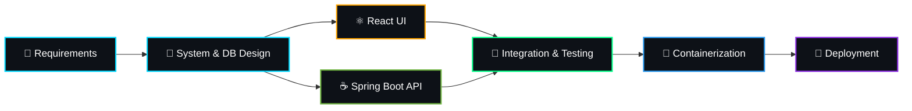

<!-- Gradient Wave Header -->

<!-- Animated Typing -->

 

<!-- Status & Focus Badges -->

  

  <b><i>"Learn continuously, build consistently, and create solutions that matter. 🚀"</i></b>

<!-- Decorative Line -->

## 👨‍💻 About Me

I am an **Information Technology Undergraduate at ITUM** passionate about building modern web applications, backend systems, and cloud architectures. With a strong foundation in Java, React, and Spring Boot, I focus on writing clean, scalable, and maintainable code. 

- 🔍 **Active Search:** Open to **Software Engineering** and **Full-Stack Developer Internships** where I can add value while expanding my technical skills.
- ⚡ **Technical Strengths:** Full-stack development with **React & Spring Boot**, database design, and version control.
- 🤝 **Community & Collaboration:** Active Open Source Contributor, participating in global programs like SWOC, GSSOC, and others.
- 🚀 **Continuous Growth:** Expanding my skillset into **AWS Cloud**, and **AI/ML**

---

## 🛠️ Technical Skills & Expertise

### 💻 Languages

### ⚛️ Frameworks & Libraries

### 🌐 Frontend & Databases

### ☁️ Cloud & DevOps

### 🔧 Developer Tools

### 🔌 Embedded Systems & Hardware

  &nbsp;
  

### 🎨 UI/UX & Design

  &nbsp;
  &nbsp;
  

### 📊 Productivity & Business

  &nbsp;
  &nbsp;
  &nbsp;
  

### 🎓 Learning Platforms

  &nbsp;
  &nbsp;
  &nbsp;
  &nbsp;
  &nbsp;
  &nbsp;
  &nbsp;
  &nbsp;
  

---

## ⚙️ Software Development Workflow

> How I think about building clean, scalable software — from user requirements to production-ready code.

```mermaid
graph LR
    A["📄 Requirements"] --> B["📐 System & DB Design"]
    B --> C["⚛️ React UI"]
    B --> D["☕ Spring Boot API"]
    C --> E["🔄 Integration & Testing"]
    D --> E
    E --> F["🐳 Containerization"]
    F --> G["🚀 Deployment"]

    style A fill:#0d1117,stroke:#00d9ff,stroke-width:2px,color:#ffffff
    style B fill:#0d1117,stroke:#00d9ff,stroke-width:2px,color:#ffffff
    style C fill:#0d1117,stroke:#ffa500,stroke-width:2px,color:#ffffff
    style D fill:#0d1117,stroke:#6db33f,stroke-width:2px,color:#ffffff
    style E fill:#0d1117,stroke:#00ff88,stroke-width:2px,color:#ffffff
    style F fill:#0d1117,stroke:#2496ed,stroke-width:2px,color:#ffffff
    style G fill:#0d1117,stroke:#8a2be2,stroke-width:2px,color:#ffffff
```

---

## 📌 Featured Projects

Here are the key projects highlighting my design, frontend, and full-stack backend capabilities:

<table width="100%">
  <tr>
    <!-- Project 1 -->
    <td width="50%" valign="top">
      <h4>📦 <a href="https://github.com/reezmahanan/SCM-IMS">SCM - Inventory Management System</a></h4>
      
A robust enterprise supply chain and inventory control system built for tracking products, managing stock, and viewing business insights.

      

        &nbsp;
        &nbsp;
        &nbsp;
        &nbsp;
        
      

    </td>
    <!-- Project 2 -->
    <td width="50%" valign="top">
      <h4>📚 <a href="https://github.com/reezmahanan/BookNest">Book Nest (Group Project)</a></h4>
      
A digital bookstore web application supporting user authentication, book catalog browsing, searching, and cart functionality.

      

        &nbsp;
        &nbsp;
        &nbsp;
        &nbsp;
        
      

    </td>
  </tr>
  <tr>
    <!-- Project 3 -->
    <td width="50%" valign="top">
      <h4>🎟️ <a href="https://github.com/reezmahanan/Student-Event-Management-Web-Application">Event Hub</a></h4>
      
A student event management web application that simplifies organizing and registering for campus events.

      

        &nbsp;
        &nbsp;
        &nbsp;
        &nbsp;
        
      

    </td>
    <!-- Project 4 -->
    <td width="50%" valign="top">
      <h4>🍳 <a href="https://github.com/reezmahanan/RECIPICK">ReciPick</a></h4>
      
A clean and responsive recipe search application that helps users find culinary instructions based on available ingredients.

      

        &nbsp;
        &nbsp;
        &nbsp;
        &nbsp;
        
      

    </td>
  </tr>
</table>

📂 View More Projects

| Project | Stack | Repository |
| :--- | :--- | :--- |
| **Reezma-Hanan-Portfolio** | React | [Repo](https://github.com/reezmahanan/Reezma-Hanan-Portfolio) • [Live](https://spectacular-narwhal-9eb659.netlify.app/) |
| **Weather App** | React, Vite | [Link](https://github.com/reezmahanan/Weather-App) |
| **TasteVerse (Frontend)** | HTML, CSS, JS | [Link](https://github.com/reezmahanan/TasteVerse.git) |
| **Reezma Tech Services (Frontend)** | HTML, CSS, JS | [Link](https://github.com/reezmahanan/Reezma-tech-service) |
| **CareerBridge (Frontend)** | HTML, CSS, JS | [Link](https://github.com/reezmahanan/CareerBridge) |

---

## 🏆 Highlighted Certifications & Professional Badges

*Selected professional credentials representing my technical competence in industry tools and frameworks:*

### 📜 Top Certifications

<table width="100%">
  <tr>
    <td width="33%" align="center">
      <b>Docker for Absolute Beginners</b> 
      <i>KodeKloud</i>  
      
    </td>
    <td width="33%" align="center">
      <b>Cyber Security Essential (LFC108)</b> 
      <i>The Linux Foundation</i>  
      
    </td>
    <td width="33%" align="center">
      <b>Agile Scrum Foundation</b> 
      <i>Simplilearn</i>  
      
    </td>
  </tr>
  <tr>
    <td width="33%" align="center">
      <b>HackerRank Verifications</b> 
      <i>Java, SQL & CSS</i>  
       
      <a href="https://github.com/user-attachments/assets/ce976dc9-1a0a-4c01-8532-71deba92aea5">Java</a> • <a href="https://github.com/user-attachments/assets/dd15f2fe-7e86-4979-b50e-cc47f980a6ae">SQL</a> • <a href="https://github.com/user-attachments/assets/58fe106f-28b0-451e-82d2-9d837eb0c473">CSS</a>
    </td>
    <td width="33%" align="center">
      <b>Front-End Web Development</b> 
      <i>University of Moratuwa CODL</i>  
      
    </td>
    <td width="33%" align="center">
      <b>Cyber Security</b> 
      <i>Cisco Networking Academy</i>  
      
    </td>
  </tr>
</table>

### 🏅 Verified Skill Badges

  &nbsp;&nbsp;
  &nbsp;&nbsp;
  &nbsp;&nbsp;
  

📑 View Additional 20+ Certifications & Foundations

Here are my other credentials in specific technologies and fundamental knowledge:

| Certificate | Issuer | View Certificate |
| :--- | :--- | :--- |
| **Introduction to Git** | Microsoft | [Image Link](https://github.com/user-attachments/assets/54776ea4-ec42-4b50-9108-40ea13519724) |
| **Introduction to Github Copilot** | Microsoft | [Image Link](https://github.com/user-attachments/assets/cef427dc-028d-44b6-b023-43f63b0d7d78) |
| **Describe Cloud Computing** | Microsoft | [Image Link](https://github.com/user-attachments/assets/caf21974-5cce-47fc-808b-7d1cc7726e45) |
| **Introduction to AI Concepts** | Microsoft | [Image Link](https://github.com/user-attachments/assets/68cb27b6-96cd-4b1c-86a1-25d613ab8b1d) |
| **Python for Beginners** | UOM CODL | [Image Link](https://github.com/user-attachments/assets/b402b5d1-9a87-4fc5-a524-d908040fc256) |
| **Web Design for Beginners** | UOM CODL | [Image Link](https://github.com/user-attachments/assets/901bd465-48d9-4a2d-85c7-d8e6f25b5a51) |
| **OOPs in Java** | Simplilearn | [Image Link](https://github.com/user-attachments/assets/8415eddb-eed0-4d18-abb0-17b67314c71e) |
| **Introduction to Cloud Computing** | Simplilearn | [Image Link](https://github.com/user-attachments/assets/f6f704f6-4af2-4628-b44e-19701f4e51fd) |
| **Introduction to Cyber Security** | Simplilearn | [Image Link](https://github.com/user-attachments/assets/708a3d71-8ed8-43fa-8d48-c4c2ef780977) |
| **UI/UX for Beginners** | Great Learning Academy | [Image Link](https://github.com/user-attachments/assets/8611355c-f9ee-4791-adab-bc72be7e9d56) |
| **HTML** | Great Learning Academy | [Image Link](https://github.com/user-attachments/assets/2fb025ee-46b8-4949-b3ba-4a9ceb4bc3e1) |
| **MySQL Tutorial** | Great Learning Academy | [Image Link](https://github.com/user-attachments/assets/3c62470d-4844-4bb2-beb6-569e878bca57) |
| **Programming Basics** | Great Learning Academy | [Image Link](https://github.com/user-attachments/assets/7c524fff-72d7-4199-8ffe-a7d3edd2a525) |
| **Python Fundamentals for Beginners** | Great Learning Academy | [Image Link](https://github.com/user-attachments/assets/a602a5be-b2c9-476c-8b55-26afd6feddb8) |
| **Python Project for Beginners** | Great Learning Academy | [Image Link](https://github.com/user-attachments/assets/315d12cd-f931-4b4d-83b7-20e2aec23a2a) |
| **Hands-On Introduction to Git with GitHub** | Udemy | [Image Link](https://github.com/user-attachments/assets/a258b2af-adf3-4bb8-90af-a296a6caf7e9) |
| **Java** | SoloLearn | [Image Link](https://github.com/user-attachments/assets/6dc5e013-7d80-4ce1-8a8d-e28ee4482824) |
| **SQL** | SoloLearn | [Image Link](https://github.com/user-attachments/assets/75104083-2c70-48ca-aabb-efccfae77c21) |
| **HTML** | SoloLearn | [Image Link](https://github.com/user-attachments/assets/4313cec7-e719-4858-be24-ad1b462bd5f0) |
| **CSS** | SoloLearn | [Image Link](https://github.com/user-attachments/assets/3a0b3f8c-36a1-4df4-8611-475400b9abd6) |
| **Python for Beginners** | SoloLearn | [Image Link](https://github.com/user-attachments/assets/ff60ec2b-4d5f-4b7b-bd10-70acb348594e) |
| **Introduction to C** | SoloLearn | [Image Link](https://github.com/user-attachments/assets/2506be40-a342-4c38-bd8c-98065424a7b4) |

---

## 🌍 Open Source Contributions

I actively collaborate on community-driven open-source projects, which allows me to gain real-world production experience:

* **SWOC (Social Winter of Code):** Open Source Contributor. Contributed to [SafeHaven](https://github.com/archangel2006/SafeHaven)
* **OSCG (Open Source Connect Global):** Open Source Contributor. Contributed to [blockchain-evidence](https://github.com/Gooichand/blockchain-evidence)
* **SSOC (Social Summer of Code):** Open Source Contributor. Contributed to [E-commerce](https://github.com/AnthropicBots/E-commerce.git)
* **GSSOC (GirlScript Summer of Code):** Open Source Contributor. Contributed to [EaseMotion-css](https://github.com/SAPTARSHI-coder/EaseMotion-css.git)

---

## 📊 GitHub Analytics & Trophies

<!-- Profile Analytics Badges -->
&nbsp;
&nbsp;

  
  
<!-- Contribution Activity Graph -->

  

<!-- Streak & Stats side by side -->
<table align="center" border="0" cellpadding="0" cellspacing="0">
  <tr>
    <td>
      
    </td>
    <td>
      
    </td>
  </tr>
</table>

 

  

#### 🏆 GitHub Trophies

  

<!-- Snake Animation -->
<picture>
  <source media="(prefers-color-scheme: dark)" srcset="https://raw.githubusercontent.com/reezmahanan/reezmahanan/output/github-contribution-grid-snake-dark.svg">
  <source media="(prefers-color-scheme: light)" srcset="https://raw.githubusercontent.com/reezmahanan/reezmahanan/output/github-contribution-grid-snake.svg">
  
</picture>

---

## 🤝 Let's Connect & Collaborate

I'm always excited about new challenges, learning opportunities, and collaboration. Feel free to reach out!

&nbsp;&nbsp;
&nbsp;&nbsp;
&nbsp;&nbsp;
&nbsp;&nbsp;
&nbsp;&nbsp;

  

  <i>"First, solve the problem. Then, write the code." — John Johnson</i>

  ⭐ If something here was useful, a star on a repo goes a long way.

 

<!-- Footer Wave -->

© 2026 Reezma Hanan • Software Engineering Undergraduate • Sri Lanka 🇱🇰

 

### ✨ Thank you for visiting! ✨

